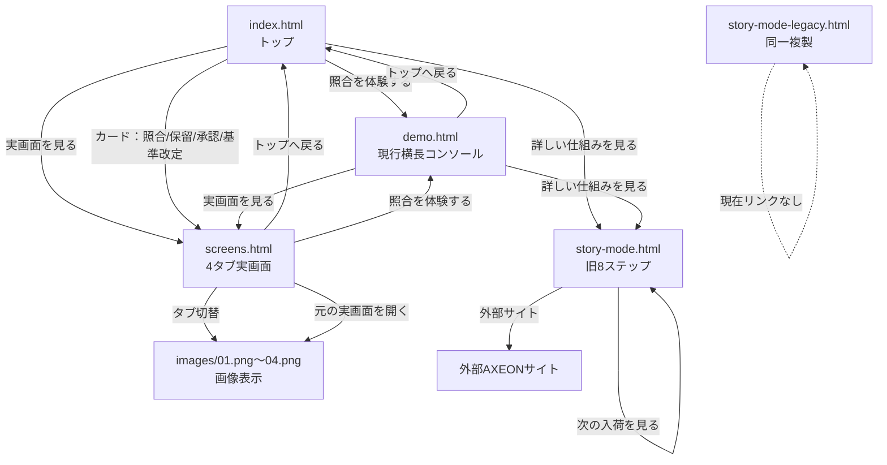

# 受入検査デモ 既存構造監査結果

コード変更は行っていません。

## 1. 現在のファイル構成

`Approval_diagram` 直下には、以下の実行ファイル・資産があります。

| 種別 | ファイル |
|---|---|
| トップ | `index.html` |
| 現行デモ入口 | `demo.html` |
| 実画面ビュー | `screens.html` |
| 旧来の8ステップ | `story-mode.html` |
| 旧来の複製 | `story-mode-legacy.html` |
| 実画面データ・表示 | `app.js` |
| 現行コンソール・2操作進行 | `flow.js` |
| トップカード画像差し替え | `preview.js` |
| 共通CSS | `styles.css` |
| Hero CSS | `hero.css` |
| 実画面タブCSS | `screens.css` |
| コンソールCSS | `console.css` |
| ローカルサーバー | `serve.mjs` |
| 実画面画像 | `images/01.png`〜`05.png` |
| Hero画像 | `images/hero.png` |
| 検証用スクリプト | `verify-p23.js`、`verify-p4.js` |
| 方針・要件 | `02_受入検査デモ_Codex改修方針書.md`、`approval-demo-requirements-v0.1.md` |
| 作業指示 | `修正.md`、`提案.md` |
| スクリーンショット | `qa-*.png` 一式 |

`story-mode.htm` は存在しません。

`Approval_diagram` 自体には `.git` がなく、Git管理対象一覧やGit履歴は確認できません。以下ではファイル内容と更新日時をもとに分類しています。

## 2. 各ファイルの役割

| ファイル | 現在の役割 | どこから遷移するか | どこへ遷移するか | 使用JS/CSS | 残すべきか |
|---|---|---|---|---|---|
| `index.html` | 現行トップ。Hero、4機能プレビュー、CTAを表示 | 直接アクセス、各画面のトップリンク | `demo.html`、`screens.html`、`screens.html?screen=...`、`story-mode.html` | `preview.js`、`styles.css`、`hero.css` | 残す |
| `demo.html` | 現行の横長コンソール入口 | `index.html` の「照合を体験する」、`screens.html` | `index.html`、`screens.html`、`story-mode.html` | `flow.js`、`styles.css`、`console.css` | 統合対象 |
| `screens.html` | 4タブの実画面画像ビュー | `index.html`、`demo.html`、4機能カード | タブ切替、画像リンク、`index.html`、`demo.html` | `app.js`、`styles.css`、`screens.css` | 統合対象 |
| `story-mode.html` | 旧来の8段階ストーリー。図解、次へ操作、実画面モーダルを内包 | `index.html` フッター、`demo.html` の詳細リンク | ページ内の8段階、Part 3、実画面モーダル、外部AXEONサイト | CSS・JSともにHTML内へ埋め込み | 中核資産として残す |
| `story-mode-legacy.html` | `story-mode.html` と同一内容の複製 | 現在リンクなし | `story-mode.html` と同じページ内遷移 | CSS・JSともにHTML内へ埋め込み | 削除候補 |
| `story-mode.htm` | ファイル自体が存在しない | なし | なし | なし | 対象外 |
| `app.js` | 実画面タイトル、タブ状態、画像表示、URLクエリ管理 | `screens.html` の読み込み | `screens.html?screen=...`、画像ファイル | `screens.css` と連動 | 残すが整理 |
| `flow.js` | 現行コンソール5列と2操作自動進行 | `demo.html` の読み込み | ページ内の状態変化のみ | `console.css` | ガイド体験へ統合検討 |
| `preview.js` | トップ4カードのサムネイルを`01.png`〜`04.png`へ置換 | `index.html` の読み込み | ページ内DOM変更のみ | `styles.css` | 残す |
| `styles.css` | 共通レイアウト、カード、実画面部品、過去のフロー用CSSを含む | 各現行HTML | なし | 各HTMLから読み込み | 残すが不要部分整理 |
| `hero.css` | 現行Heroの画像背景、オーバーレイ、レスポンシブ | `index.html` | なし | `index.html` | 残す |
| `screens.css` | 実画面タブ、表示領域、画像表示 | `screens.html` | なし | `screens.html` | 残す |
| `console.css` | 横長コンソール、開始案内、状態表示、2操作ボタン | `demo.html` | なし | `demo.html` | ガイド体験へ統合検討 |
| `serve.mjs` | 静的ローカルサーバー | 手動起動 | ファイル配信 | Node標準API | 開発用として残す |
| `images/01.png` | 照合実画面 | `screens.html`、Story Modeの埋込データ | 画像表示・新規タブ | なし | 残す |
| `images/02.png` | 保留一覧実画面 | 同上 | 同上 | なし | 残す |
| `images/03.png` | 承認実画面 | 同上 | 同上 | なし | 残す |
| `images/04.png` | 基準改定実画面 | 同上 | 同上 | なし | 残す |
| `images/05.png` | 追加実画面資産 | 現行コードから直接参照なし | なし | なし | 利用状況確認後に判断 |
| `images/hero.png` | Hero用の実写寄りビジュアル | `index.html` | Hero表示 | なし | 残す |
| `verify-p23.js` | Phase 2・3のブラウザー検証用 | 手動実行 | なし | ブラウザー内実行前提 | 開発用 |
| `verify-p4.js` | Phase 4の2操作検証用 | 手動実行 | なし | ブラウザー内実行前提 | 開発用 |
| `qa-*.png` | 各Phaseの確認用画像 | なし | なし | なし | 公開構成からは除外候補 |
| `02_受入検査デモ_Codex改修方針書.md` | 旧方針。Hero右側UI、4機能、Story補助化を定義 | なし | なし | なし | 判断資料として残す |
| `approval-demo-requirements-v0.1.md` | 旧要件。8段階、図解原則、画像仕様を定義 | なし | なし | なし | 既存表現の正本として残す |
| `修正.md` | Phase 1〜5の実装指示 | なし | なし | なし | 作業記録として残す |
| `提案.md` | 監査結果と整理案 | なし | なし | なし | 作業記録として残す |

## 3. `story-mode.html` と `story-mode.htm`

- `story-mode.htm` は存在しない。
- `story-mode.html` と `story-mode-legacy.html` はSHA-256が同一で、内容が完全一致している。
- 両方とも2026年8月12日作成の、現行の新規ファイル群より古い資産。
- 現在のコードからリンクされているのは `story-mode.html` のみ。
- `story-mode-legacy.html` へのリンクは存在しない。
- したがって、`story-mode-legacy.html` は「旧版」ではなく、現時点では同一内容の複製ファイルです。
- 8ステップの本体は `story-mode.html` に残っています。

## 4. 8ステップ資産の所在

`story-mode.html` 内に以下がすべて残っています。

- 図面指定の表示
- 材料証明書の表示
- 対応線を1本ずつ引く表現
- 受入検査から後工程までの工程表示
- 要確認・記載なしの強調
- 承認の連なり
- 8段階の説明文
- `1 / 8`〜`8 / 8` のカウンター
- `次へ`、`最初から`
- 最終段のテロップ
- 実画面モーダル
- 照合、保留、承認、基準改定の画像
- Part 3の基準改定後の追加ストーリー

8段階の現在の内容は以下です。

1. 図面で材質と板厚が指定されている
2. 届いた材料の証明書と並べて見る
3. 1項目ずつ目で確かめる
4. 受入検査で確認する
5. 2か所ともそのまま通っている
6. 不具合発生後にロットを調べる
7. 4項目を同時に照合する
8. 材質記号とロット番号を人が確認する

ただし、現在は以下の理由で完成形のメイン導線には使いにくい状態です。

- `次へ`を8回押す設計
- 370px前後の縦長ラッパー
- PC向け横長再配置がない
- 現行コンソールとは別の独立実装
- 現行の4タブ画面とは直接接続されていない
- `実際の画面を見る` はページ内モーダルを開く設計
- そのモーダルは現在の `screens.html` とは別実装

## 5. 現在の遷移図

### 実装上の導線

#### `index.html`

- ブランド → `index.html`
- ヘッダーの「実画面を見る」 → `screens.html`
- 「照合を体験する」 → `demo.html`
- 「実画面を見る」 → `screens.html`
- 4カードのリンク → `screens.html?screen=match|hold|approval|standard`
- フッターの「詳しい仕組みを見る」 → `story-mode.html`

#### `demo.html`

- ブランド → `index.html`
- 「トップへ戻る」 → `index.html`
- 「実画面を見る」 → `screens.html`
- 「詳しい仕組みを見る」 → `story-mode.html`
- `flow.js` がページ内のボタン操作を処理
- 画面遷移なしで、図面・証明書・判定・人判断・承認の状態を置き換える

#### `screens.html`

- ブランド → `index.html`
- 「トップへ戻る」 → `index.html`
- 「照合を体験する」 → `demo.html`
- 4タブは `app.js` がページ内表示を切り替える
- タブ切替時に `?screen=match|hold|approval|standard` をHistory APIへ反映
- 「元の実画面を開く」 → `images/01.png`〜`04.png` を新規タブで開く

#### `story-mode.html`

- `start` → ゲートを非表示にして8段階本編を表示
- `next` → 1段階進める
- `reset` → 最初へ戻る
- `openrec` → ページ内実画面モーダルを開く
- `tonext` → Part 3を開く
- `next3` → Part 3内を進める
- `back3` → 本編へ戻る
- `closerec`、Esc → モーダルを閉じる
- 外部AXEONサイトへのリンクあり
- `index.html`、`demo.html`、`screens.html` へ戻る共通導線はない

## 6. 新しく追加された資産

Git履歴はないため断定ではなく、更新日時と内容からの分類です。

### 現行統合系

- `demo.html`
- `screens.html`
- `flow.js`
- `console.css`
- `screens.css`
- `hero.css`
- `hero.png`
- `verify-p23.js`
- `verify-p4.js`

### 既存資産を置き換えている部分

#### `demo.html` / `flow.js`

目的：

- 旧8ステップを短い2操作のコンソールに置き換える
- PC向け横長表示にする
- 画面遷移を減らす

重複：

- 図面表示
- 証明書表示
- 判定
- 人判断
- 承認
- 基準改定

これらは `story-mode.html` の既存表現と役割が重なっていますが、視覚表現は別物です。

#### `screens.html` / `app.js`

目的：

- 実画面4種を同一ページの4タブで表示する
- `images/01.png`〜`04.png` を直接見せる

重複：

- `story-mode.html` の実画面モーダル
- `app.js` 内の旧HTML画面定義
- `index.html` の4カード

特に現在の `app.js` は、`screens` オブジェクト内に4画面のHTML定義を残している一方、実際の表示は画像を直接挿入しています。そのため、画面定義HTMLと画像表示が二重化しています。

#### `hero.css` / `hero.png`

目的：

- 旧Heroの比較UIを外し、画像中心のHeroにする

現在：

- `hero.png` は画像内に照合・証明書・判定UIをすでに含む
- `hero.css` は画像上のテキスト、CTA、オーバーレイを担当

## 7. 重複ファイル・重複実装

### 完全複製

- `story-mode.html`
- `story-mode-legacy.html`

完全に同一で、現行リンクは `story-mode.html` に集中しています。

### 実画面の重複

同じ4業務画面について、次の3系統があります。

1. `app.js` のHTMLテンプレート
2. `images/01.png`〜`04.png`
3. `story-mode.html` 内のbase64画像モーダル

### ガイド体験の重複

同じ業務ストーリーが次の2系統に分かれています。

1. `story-mode.html`
   - 図解中心
   - 8回の手動操作
   - 既存の視覚表現と説明文
2. `demo.html` + `flow.js`
   - 5列コンソール
   - 2操作の自動進行
   - 新しいプレースホルダーと状態更新

### CSSの重複

- `story-mode.html`：巨大なインラインCSS
- `styles.css`：共通UIと過去のフロー用スタイル
- `console.css`：現行コンソール
- `screens.css`：実画面ビュー
- `hero.css`：トップHero

単一のデモとして見ると、責務が分散しています。

## 8. 残すもの

- `index.html`
  - 最終トップとして残す
  - 現在のHero画像と4機能プレビューを利用
- `story-mode.html`
  - 既存8ステップの視覚表現、説明文、アニメーション資産の正本として残す
- `images/01.png`〜`04.png`
  - 4実画面の完成済み資産として残す
- `images/hero.png`
  - 現行Heroの主役画像として残す
- `app.js`
  - 4画面の名称・対応関係・タブ状態のデータ源として整理して残す
- `preview.js`
  - トップカードのサムネイル用として残す
- `styles.css`
  - 共通スタイルの母体として残す
- `screens.css`
  - 実画面ビュー用として残す
- `approval-demo-requirements-v0.1.md`
  - 8ステップの意味と視覚設計の正本として残す

## 9. 統合するもの

### `demo.html` と `story-mode.html`

`demo.html` の現行コンソールを独立した別デモとして維持するのではなく、`story-mode.html` の既存図解をPC向けに再配置するガイド体験へ統合する候補です。

統合後の役割：

- `index.html` の「照合を体験する」からガイドへ入る
- 最初に「体験を開始」を1回押す
- 既存8段階の図解を自動進行
- 現在のSceneに対応する「実画面を見る」ボタンを常時表示
- ガイド、実画面、トップの共通ナビゲーションを設置

### `screens.html` とStory Modeの実画面モーダル

実画面の表示先は `screens.html` に一本化する候補です。

- 照合Scene → `screens.html?screen=match`
- 人判断Scene → `screens.html?screen=hold`
- 承認Scene → `screens.html?screen=approval`
- 基準改定Scene → `screens.html?screen=standard`

### `app.js` の画面定義HTMLと画像表示

現在は画像を表示しているため、`screens` 内のHTMLテンプレートは不要になる可能性があります。

ただし、削除前に以下を確認する必要があります。

- 画像が存在しない場合の代替表示が必要か
- 将来の実画面インタラクションに使うか
- Story Modeのモーダルを置き換えるか

## 10. 削除候補

現時点で安全性が高い候補：

- `story-mode-legacy.html`
  - `story-mode.html` と完全一致
  - 現在リンクなし
- `qa-*.png`
  - 実行時に参照されていない検証成果物
- `verify-p23.js`
  - 検証完了後に保管不要なら削除候補
- `verify-p4.js`
  - 検証完了後に保管不要なら削除候補

統合後に整理する候補：

- `demo.html`
  - ガイド体験を`story-mode.html`へ統合した場合
- `flow.js`
  - 旧コンソールを廃止し、8ステップ自動進行をStory側へ移した場合
- `console.css`
  - `demo.html`廃止時
- `app.js` 内の未使用HTMLテンプレート
  - 実画面画像一本化が確定した場合

まだ削除すべきでないもの：

- `story-mode.html`
- `images/01.png`〜`04.png`
- `images/hero.png`
- `approval-demo-requirements-v0.1.md`
- `styles.css`

## 11. 最終構成案

新しいHTMLルートを増やさない前提では、HTMLは次の3ページに絞るのが自然です。

| ファイル | 最終役割 |
|---|---|
| `index.html` | TOP。Hero、照合体験CTA、実画面CTA、4機能プレビュー |
| `story-mode.html` | ガイド体験。既存8ステップを自動進行化し、PC向け横長に再配置 |
| `screens.html` | 実画面。照合・保留一覧・承認・基準改定の4タブ |

整理後に不要になる候補：

- `demo.html`
- `story-mode-legacy.html`
- `flow.js`
- `console.css`
- `app.js` 内の重複HTMLテンプレート
- 検証用 `qa-*.png`、`verify-*.js`（保管方針による）

`demo.html` を残す場合は、`story-mode.html` と役割が重ならないように明確な別用途が必要です。今回の完成形では、ガイド体験を`story-mode.html`へ統合する方が、ユーザー導線と既存資産の所在を一貫させられます。
